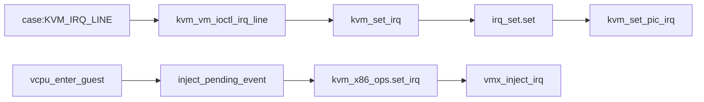
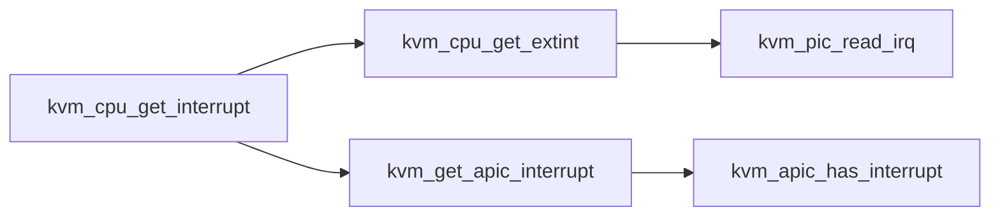

# 实验一：自定义中断添加与注入

 **在虚拟机中增加自定义中断向量，KVM 向虚拟机注入虚拟中断，触发虚拟机对该中断的处理。** 

## 背景知识

### **Linux 中断的申请和释放**

request_irq / free_irq

```c
# linux-4.14/include/linux/interrupt.h

static inline int __must_check
request_irq(unsigned int irq, irq_handler_t handler, unsigned long flags,
	    const char *name, void *dev)
{
	return request_threaded_irq(irq, handler, NULL, flags, name, dev);
}

extern const void *free_irq(unsigned int, void *);
```

函数 request_irq 用来申请中断资源，irq 表示设备对应的中断号，handler 表示中断处理函数，flags 表示触发方式，name 表示中断名称，自定义，主要是给用户查看的，dev 一般设置为设备结构体，会传递给中断处理函数的第二个参数。

函数 free_irq 用来释放中断资源，第一个参数是 irq中断号，第二个参数 dev，与 request_irq 的第一个和最后一个参数一致。


### **KVM 中断模拟**

1. KVM 对设备发来的中断进行模拟处理，向VCPU注入中断信号。设备调用 ioctl(KVM_IRQ_LINE) 通知 KVM 发送中断，KVM 中对应处理函数为`kvm_vm_ioctl_irq_line` ，调用 `kvm_set_irq(struct kvm *kvm, int irq_source_id, u32 irq, int level, bool line_status)` 。
2. 控制流从 KVM 返回虚拟机，vcpu_enter_guest，`vmx_inject_irq` 将中断向量写入VMCS。
3. 虚拟机根据VMCS字段内容，通过IDT表找到中断处理函数。

(PIC for example)




### **中断线与中断向量**

**概念区分**：中断线是硬件概念，设备连接某一条中断线。中断向量是操作系统概念，通过中断向量号作为索引在IDT表中寻找中断处理例程。

**二者的转换**：

在pin-base机制中，设备直接向中断线发送信号，中断控制器（PIC或者I/O APIC）把中断线号转换成中断向量号发送给CPU。I/O APIC中二者的转换通过I/O APIC的I/O重定向表完成；在MSI/MSIX中，设备直接向CPU的LAPIC写入中断向量号信息。

上文request_irq中的irq号即中断线号，操作系统中的vector表示中断向量号。

相关代码： vcpu_enter_guest中的kvm_cpu_get_interrupt 函数获取中断向量号（PIC为例）




```c
# linux-5.15/arch/x86/kvm/irq.c

int kvm_cpu_get_interrupt(struct kvm_vcpu *v)
{
	int vector = kvm_cpu_get_extint(v);
	if (vector != -1)
		return vector;			/* PIC */

	return kvm_get_apic_interrupt(v);	/* APIC */
}
```

```c
# linux-5.15/arch/x86/kvm/i8259.c

int kvm_pic_read_irq(struct kvm *kvm)
{
    // 部分代码
	irq = pic_get_irq(&s->pics[0]);
    // PIC控制器的irq_base与irq相加得到中断向量号
	intno = s->pics[0].irq_base + irq;
    return intno;
}
```

**也就是说，kvm_set_irq 中参数irq表示硬件概念，与驱动中设置的irq一致。**


## 解决思路

### 虚拟机中驱动的实现

1. 模块初始化时注册irq。——调用函数request_irq(IRQ_NUM, demo_handle_irq, IRQF_SHARED, DRV_MODULE_NAME, &demo_dev)

   ```c
   // 驱动 demo.c
   static int __init demodev_driver_init(void)
   {
   	int devno;
   	dev_t num_dev;
   
   	printk("demodev_driver_init is called. \n");
   
   	// 注册中断处理函数
       if(request_irq(IRQ_NUM, demoirq_handler, IRQF_SHARED, DRV_MODULE_NAME, &demodev)!=0)
       {
           printk("register irq[%d] handler failed. \n", IRQ_NUM);
           return -1;
       }
   	printk("request irq success.\n");
       ...
   }
   ```

2. 中断号的选取。——本实验选取未预先配置的中断号IRQ 10。

3. irq的处理。——输出当前IRQ号以及中断处理函数的地址。

   ```c
   // 驱动 demo.c
   static irqreturn_t demoirq_handler(int irq, void * dev)
   {
       struct demoirq demodev;
       demodev = *(struct demoirq*)dev;	
   	
   	if (IRQ_DRIVER_ID == demodev.devid)
   	{
   		printk("[demoirq_handler] irq_num: %u, demoirq_handler address: %p\n", IRQ_NUM, demoirq_handler);
   	}	
   
   	return IRQ_HANDLED;
   }
   ```

4. 模块关闭时注销irq。free_irq(IRQ_NUM, &demo_dev)

   ```c
   // 驱动 demo.c
   static void __exit demodev_driver_exit(void)
   {	
   	printk("demodev_driver_exit is called. \n");
   	...
   	free_irq(IRQ_NUM, &demodev);
   }
   ```

### KVM 向虚拟机注入中断

添加 ioctl KVM_IRQ_DEMO 处理实例，调用kvm_set_irq函数实现对虚拟机的中断注入。

```c
# linux-5.15/virt/kvm/kvm_main.c
static long kvm_vm_ioctl(struct file *filp,
			   unsigned int ioctl, unsigned long arg)
{
	struct kvm *kvm = filp->private_data;
	void __user *argp = (void __user *)arg;
	int r;
	...
	case KVM_IRQ_DEMO: {
		int ret;
		// raise my irq
		// kvm_set_irq(kvm, KVM_USERSPACE_IRQ_SOURCE_ID, irq_num, irq_event->level, line_status);
		printk("case KVM_IRQ_DEMO: kvm_set_irq\n");
		
		ret = kvm_set_irq(kvm, 0, 10, 1, false);
        printk("[JNDebug] kvm_set_irq(level 1) return = %d\n", ret);
		// 如果不加这个level 0 会导致虚拟机死循环demo_irq_handle程序
		ret = kvm_set_irq(kvm, 0, 10, 0, false);
        printk("[JNDebug] kvm_set_irq(level 0) return = %d\n", ret);
		
		break;
	}
    ...
}
```

### QEMU 中添加自定义命令实现从monitor触发中断

通过hmp协议实现从qemu触发irq中断。

```c
# qemu-4.4.0/hmp.c
void hmp_raise_irq_demo(Monitor *mon, const QDict *qdict)
{
    // ioctl
    kvm_vm_ioctl(kvm_state, KVM_IRQ_DEMO);
    monitor_printf(mon, "hmp raise irq demo\n");
}
```


## 实现过程

宿主机：

```bash
# 打补丁，编译QEMU
make
make install

# 打补丁，编译KVM  
sudo sh build-kvm.sh 

# qemu 启动  
qemu-system-x86_64 -m 2048 -smp 4 --enable-kvm -drive file=../guest.img,format=raw -cdrom ../ubuntu-16.04.7-desktop-amd64.iso

# 连接VNC    
gvncviewer 127.0.0.1::5900

# 查看日志
dmesg -w
```

虚拟机：

```bash
# 添加demo.c和Makefile文件，编译驱动模块
make

# 安装驱动模块     
sudo insmod demo.ko

# 查看中断       
head /proc/interrupts

# Ctrl+Alt+2 进入qemu monitor模式      
raise_irq_demo

# Ctrl+Alt+1 回到正常模式  查看日志    
dmesg
```

结果：

中断的注册

<div style="text-align: center;">
    
</div>

中断的处理

<div style="text-align: center;">
    
</div>

<div style="text-align: center;">
    
</div>

内核输出

<div style="text-align: center;">
    
</div>

# 实验二：设备添加异步中断机制

 **基于第四章实验的自定义虚拟设备，增加 APIC中断机制的支持。** 

## 解决思路

本实验以write操作为例模拟实际环境中I/O的处理。虚拟机中对QEMU设备发送write请求后，主动调度让出CPU，等待中断处理函数唤醒再继续处理。QEMU设备收到write请求后，核验有效性后启动一个线程来处理具体的write请求，线程处理完之后触发irq中断通知虚拟机的驱动。

### 虚拟机驱动中I/O的主动调度及唤醒

执行完writel之后，陷入到宿主机QEMU处理，主动调度让出CPU等待QEMU处理完。

```c
// demo.c
static ssize_t demo_write(struct file *fp, const char __user *ubuf,
						size_t len, loff_t *off)
{
	int ret = -1;
	uint32_t val = 0;
	
	printk("demo_write() begin\n");

	if (len != 4)
	{
		printk(KERN_ERR "write error len\n");
		return -EINVAL;
	}

	ret = copy_from_user(&val, ubuf, 4);

	if (ret)
	{
		printk(KERN_ERR "copy_from_user fail\n");
		return -EINVAL;
	}

	writel(val, data->bar0);

	// add schedule()
	// add signal to printk
	DECLARE_WAITQUEUE(wait, current);
	if (signal != 1)
	{
		// prepare to wait
		add_wait_queue(&data->write_wait, &wait);
		set_current_state(TASK_INTERRUPTIBLE);

		printk("wait for write done signal\n");

		schedule();
		remove_wait_queue(&data->write_wait, &wait);
	}
	signal = 0;

	printk("demo_read() copy_from_user: %x\n", val);
	printk("demo_read() end\n");

	return 4;
}
```

中断处理函数中唤醒当前进程。

```c
// demo.c
static irqreturn_t demoirq_handler(int irq, void * dev)
{
	printk("[demoirq_handler] irq_num: %u, demoirq_handler address: %p\n", IRQ_NUM, demoirq_handler);
	signal = 1;
	wake_up(&data->write_wait);

	return IRQ_HANDLED;
}
```


### QEMU设备中I/O的处理及中断通知

qemu_thread_create 开启新线程demo_write_thread处理write请求，处理完成之后调用ioctl向虚拟机注入中断。

```c

static void *demo_write_thread(void *opaque)
{
    // handle write
    DemoState *demo = opaque;
    sleep(10);
    switch (demo->addr) {
        case 0x00:
            demo->buff = demo->val;
            break;
    }
    
    // demo_raise_irq
    kvm_vm_ioctl(kvm_state, KVM_IRQ_DEMO);

    return NULL;
}

static int demo_mmio_write(void *opaque, hwaddr addr, uint64_t val,
                unsigned size)
{
    DemoState *demo = opaque;

    if (addr != 0x00 ||  size != 4) {
        return -1;
    }

    // create thread 
    demo->addr = addr;
    demo->val = val;
    demo->size = size;
    qemu_thread_create(&demo->thread, "demo_write_thread", demo_write_thread,
                           demo, QEMU_THREAD_JOINABLE);

    return 1;
}
```

### KVM中断注入

同实验一。


## 实现过程

宿主机：

```bash
# 打补丁，编译QEMU
make
make install

# 打补丁，编译KVM  
sudo sh build-kvm.sh 

# qemu 启动  
qemu-system-x86_64 -m 2048 -smp 4 --enable-kvm -drive file=../guest.img,format=raw --device demo

# 连接VNC    
gvncviewer 127.0.0.1::5900

# 查看日志
dmesg -w
```

虚拟机：

```bash
# 添加demo.c和Makefile文件，编译驱动模块
make

# 安装驱动模块     
sudo insmod demo.ko

# 查看注册的设备编号
cat /proc/device | grep demo
# 输出：
# 245 demo

# 给编号245的驱动创建设备文件 
sudo mknod /dev/demo c 245 0

# 运行用户态测试程序
sudo ./test

# 检查内核输出
dmesg
```

结果：

<div style="text-align: center;">
    
</div>

<div style="text-align: center;">
    
</div>
